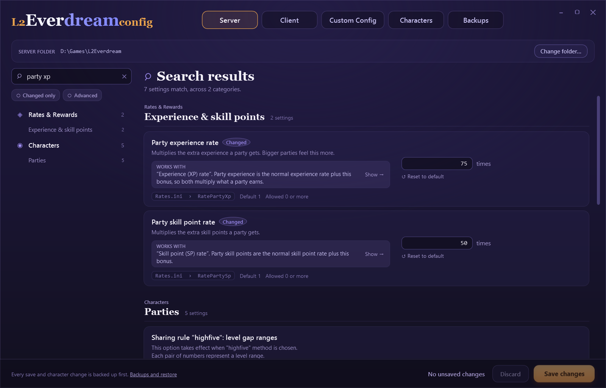
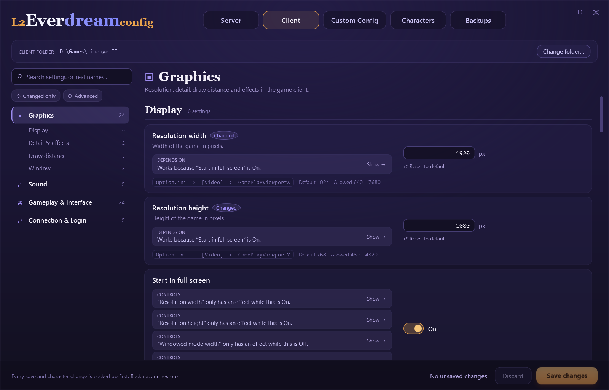
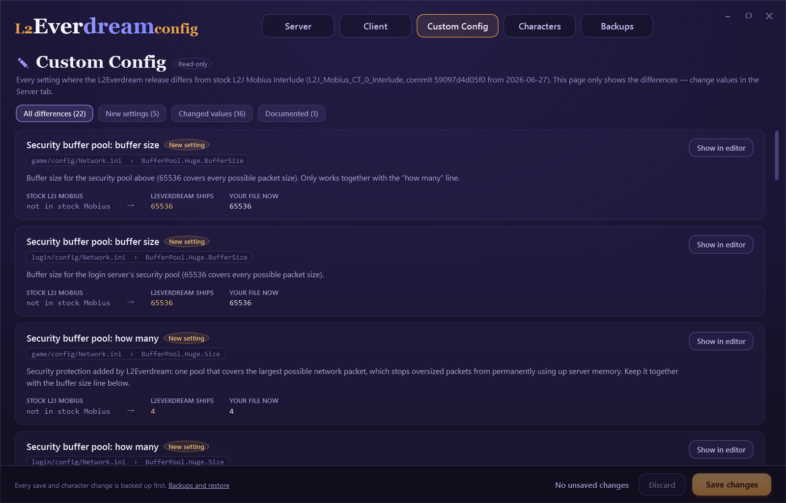
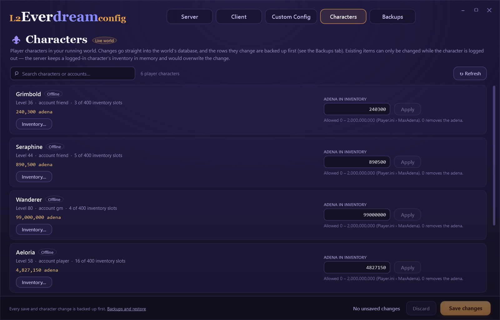
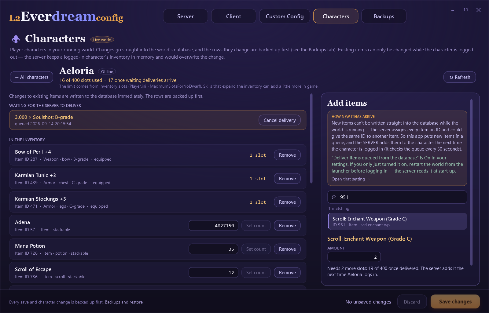
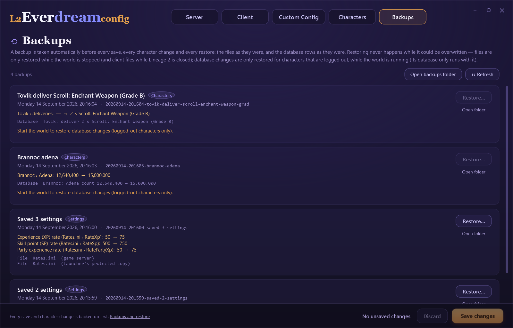

# L2Everdream Config

**Change every setting of your own L2Everdream world and your Lineage 2 client, without opening a single config file.**

[L2Everdream](https://l2everdream.com) lets you run a full Lineage 2 Interlude world on your own PC. That world is controlled by well over a thousand
settings spread across dozens of `.ini` files, some of them encrypted, some of them quietly rewritten by the launcher, and all of them
named things like `RateDropSpoil` or `AltPartyRange2`.

L2Everdream Config puts all of them in one window. Each setting has a plain-English name and a description. Settings are grouped by what they
do, not by which file they live in, and each shows the real file and key it saves to. You can't enter a value the server would reject. It
also edits your player characters' adena and inventories, and it backs up everything before it changes anything.

> **For your local world only.** This edits the world and the client **on your own computer**. It cannot touch the public L2Everdream
> servers, and it never starts, stops or controls your server, database or game. That stays the launcher's job.

> This is an independent, unofficial tool. See [Credits](#credits).


<sub>Screenshots show a demo world with made-up characters.</sub>

---

## Contents

- [Getting started](#getting-started)
- [What you can do](#what-you-can-do)
  - [Server settings](#server-settings)
  - [Client settings](#client-settings)
  - [How settings affect each other](#how-settings-affect-each-other)
  - [Custom Config: what L2Everdream changed](#custom-config-what-l2everdream-changed)
  - [Characters and inventories](#characters-and-inventories)
  - [Backups and restore](#backups-and-restore)
- [What it will and won't do](#what-it-will-and-wont-do)
- [Where your changes are saved](#where-your-changes-are-saved)
- [Common questions](#common-questions)
- [Privacy](#privacy)
- [For developers](#for-developers)
- [Licence](#licence)
- [Credits](#credits)

---

## Getting started

**1. Download it.** Get the latest version from the [Releases page](../../releases). There are two:

| Download | Size | |
|---|---|---|
| **standalone** | 54 MB | Nothing else to install. **Pick this one.** |
| **needs-dotnet** | 1 MB | Much smaller, but you must first install the [.NET 10 Desktop Runtime (x64)](https://dotnet.microsoft.com/download/dotnet/10.0). |

Unzip it anywhere. Your Desktop is fine.

**2. Run `L2EverdreamConfig.exe`.** There is no installer and there never will be. The program is a single file that runs from any folder.
You can move it, copy it to a USB stick, or delete it when you're done.

If Windows shows a blue "Windows protected your PC" box, click **More info**, then **Run anyway**. Windows shows that box for any program
that doesn't have a paid code-signing certificate.

**3. Choose your folders.** The program never guesses where things are. You pick both folders once, and it remembers them.

| Tab | Choose | You'll know it's right because it contains |
|---|---|---|
| **Server** | Your L2Everdream install folder. With the official launcher, that is `%LOCALAPPDATA%\L2Everdream`: paste that into the folder picker's address bar. | `game\config\Server.ini` |
| **Client** | Your Lineage 2 folder (or its `system` folder) | `system\l2.ini` |

If you pick the wrong folder, it tells you what is missing. Nothing is written until you click **Save changes**.

**4. Change something and save.** Find a setting in the list on the left or with search, change it, then click **Save changes**. Server
changes take effect the next time you start your world from the launcher. Client changes take effect the next time you start Lineage 2.

---

## What you can do

### Server settings

The **Server** tab holds **1,322 server settings**: 1,257 for the game server and 65 for the login server. It also has the 5 world settings
from the launcher's `world-profile.json`, such as how many simulated players fill your world.

Settings are sorted into 16 categories by what they do:

> Your World · Rates & Rewards · Characters · Skills & Combat · Items & Enchanting · Economy & Trade · PvP & Karma · Clans & Sieges ·
> Olympiad & Heroes · Events & Activities · Monsters & Bosses · Chat & Community · Convenience Features · GM & Administration ·
> Protection & Anti-cheat · Server & Performance

Each category is split into groups. For example, **Rates & Rewards** has *Experience & skill points*, *Quest rewards*, *Monster drops* and more.

**Finding a setting**

- **The section list** on the left shows every category with a count. Click one to open its groups, then click a group to jump to it.
- **Search** matches the friendly name, the real key, the file name and the description. `party xp`, `RateXp` and `Rates.ini` all work.
  While you search, the section list shows only the categories and groups that match.
- **Changed only** shows the settings that differ from their default, or that you have edited but not saved.
- **Advanced** reveals 359 rarely needed settings (buffer sizes, thread pools, protocol details). They are hidden by default so the
  everyday ones are easy to find.



**Every setting card shows**

- A **friendly name** and a **description** of what it does.
- A chip with the **real name**, `File › [Section] › Key`, so you always know exactly what is being changed.
- The **default** value and the **allowed range**.
- An editor that fits the setting: an on/off switch, a number box, a slider, a dropdown, a list box or a password box.
- **Unsaved** or **Changed** labels, **Undo**, and **Reset to default**.
- A lock, with the reason, on the few values the launcher sets for you (see [below](#where-your-changes-are-saved)).


**Only valid values**

Every setting has a type, a range and, where needed, a format. Number boxes refuse letters. Values outside the allowed range are marked
with a plain-language reason, and **Save changes** refuses them. Lists are checked too: item ID lists, coordinates, times of day, days
of the week, colours, IP addresses, and percentage splits that must add up to 100.

The limits are never stricter than what actually ships. An automated test fails if any value in a real install would be rejected.

### Client settings

The **Client** tab edits your Lineage 2 client's settings in four categories: **Graphics · Sound · Gameplay & Interface · Connection & Login**.

- **`Option.ini`** (58 settings): resolution, window mode, texture and effect quality, sound and music volume, interface options, and more.
- **`l2.ini`** (23 settings): this file is **encrypted** in the client. The program decodes it, changes only what you edited, and encodes
  it again. Before writing, it decodes its own result and compares it, so the file the game reads is always valid.

Lineage 2 rewrites its settings when it closes, so **client changes can't be saved while the game is running**. The program tells you
when that is the case.



### How settings affect each other

Many settings do nothing unless another setting is on, and some switch a whole feature on or off. Setting cards show this directly and
update as you edit:

| Line | Meaning |
|---|---|
| **Depends on** (green) | This setting needs another one, and that one is set correctly. |
| **Has no effect right now** (amber) | This setting needs another one that is currently off. For example, vitality rates do nothing while the vitality system is disabled. |
| **Controls** | This is a master switch; the settings it controls only work while it is on. |
| **Works with** | Related settings you'll probably want to look at together. |

Each line has a **Show →** button that jumps straight to the other setting. There are 359 of these links, plus rules the program works out
from the config files themselves.

### Custom Config: what L2Everdream changed

L2Everdream is built on [L2J Mobius](https://l2jmobius.org/) (CT 0 Interlude). The read-only **Custom Config** tab shows how the
configuration L2Everdream ships differs from stock L2J Mobius. It lists new settings added by code changes, values that were changed (rates,
free teleports, party leader hand-off, dropped item lifetime, monster leash distance and more), and changed files.

Each difference shows **stock → shipped → your file now**, flags any value you have changed yourself, and has **Show in editor** to jump
to that setting in the Server tab. This tab never writes anything.



### Characters and inventories

The **Characters** tab lists the **player characters** in your world, with level, account, how many inventory slots they use of their
limit, and their adena. The simulated players that populate the world are never listed.

Your world's database only runs while your world is running, so **start your world from the launcher first**.



**Adena and existing items** can be changed or removed **while that character is logged out**. Open **Inventory…** to see everything the
character carries (equipped items are marked). Use **Set count** on stacks, or **Remove** (you're asked to confirm).

**Adding items** works differently. **Read this before using it.**

The running server keeps track of every item in memory. Writing a new item straight into the database while the server runs can clash
with that, so this program **never does**. Instead, new items are **handed to the server to deliver**:

1. Search the full item list (over 9,000 items, including L2Everdream's custom ones) by name or ID, and choose an amount. Weapons and
   armour can also have an enchant level.
2. A line tells you exactly what will happen and how many inventory slots it needs. If something isn't allowed, it tells you why instead.
3. The item goes onto a delivery list. The server adds it to the character **the next time they are online**, at its next check (how often it checks is the
   setting **Check for new mail every**, 30 seconds as shipped).
4. Until then, it appears under **Waiting for the server to deliver**, where you can **Cancel delivery**.



For this to work, the server setting **Deliver items queued from the database** (`Custom/CustomMailManager.ini › CustomMailManagerEnabled`)
must be **on**, and your world must have been **restarted after turning it on**. The inventory screen shows whether it currently is.
Adding more of a stackable item the character already carries (adena, arrows, potions) doesn't need delivery: it changes that stack straight away.

**Protection against broken characters**

- **Inventory limit.** Adding items is refused if it would take the character over their inventory limit. The limit is counted exactly
  as the server counts it: equipped items, everything carried, deliveries already waiting, dwarves' larger inventory, and Game Master
  access. Too many items can stop a character from loading.
- **Stack limits.** Stacks can't go past what the server allows, and adena is capped at your world's **Maximum adena** setting.
- **Online check.** Every change locks the character in the database and checks again that they are logged out in the same step, so a
  change can never race a player logging in.

### Backups and restore

**Everything is backed up before it is changed.** That includes every settings save, every adena or item change, every delivery queued
or cancelled, and every restore.

Each backup is one folder in `%LOCALAPPDATA%\L2EverdreamConfig\backups`, named by date and what it was, for example
`20260914-101500-saved-3-settings`. Inside are plain copies of the files as they were, the database rows as they were (as readable JSON),
and a `manifest.json` recording where each file came from, its SHA-256 fingerprint, and what changed from what to what.

The **Backups** tab lists every backup, newest first, with what changed. **Restore…** first shows a plan of what will and won't be
restored right now. After a restore you see the result for each item. **Open folder** shows the files themselves.



Restores follow strict rules so they can never clash with a running game:

| Backup of | Can be restored |
|---|---|
| Server settings | Only while your **world is stopped** |
| Client settings | Only while **Lineage 2 is closed** |
| Character changes | Only while your **world is running** (its database runs with it), and only for characters who are **logged out** |

- Every restore checks each file's fingerprint first, and refuses database rows that came from a different world.
- Every restore is itself backed up first, so **a restore can be undone**.
- A removed item can be put back with its original identity only if the world hasn't been restarted since the backup. Otherwise the program
  tells you it can't, rather than risk a clash.
- Deliveries that haven't happened yet are withdrawn. Cancelled deliveries are queued again if they still fit.

---

## What it will and won't do

| It will | It won't |
|---|---|
| Edit the server and client **on this PC** | Connect to, or change, the public L2Everdream servers |
| Read whether your world is running and whether Lineage 2 is open, to warn you | Start, stop or restart your world, its database or the game |
| Save server settings while the world runs (they apply on the next start) | Save client settings while Lineage 2 is running |
| Change adena and items of logged-out player characters | Touch simulated players, or change characters who are logged in |
| Queue new items for the server to deliver | Write new item rows into the database while the server runs |
| Back up everything before every change | Delete your backups |
| Refuse values the server would reject, with a reason | Let an invalid value reach a config file |

---

## Where your changes are saved

**Server settings are saved to two places.** The L2Everdream launcher keeps a protected copy of your config files in
`L2Everdream-data\db\config`, and merges it back over the install every time it starts or updates. The program writes **both** the install
copy and that protected copy. That way your changes survive launcher updates and aren't quietly undone on the next start.

**Formatting is preserved.** Only the value you changed is rewritten. Comments, spacing, ordering and line endings stay exactly as they
were. Every file is written in one step, so a crash or power cut can't leave a half-written file.

**A few values belong to the launcher.** The launcher rewrites these on every start, so the program shows them locked, with the reason,
instead of letting you change something that would silently revert:

- the database connection addresses in `Database.ini`
- the login port (`LoginPort`) and automatic account creation (`AutoCreateAccounts`)
- the class master configuration (`ClassMaster.xml`), set through the launcher's own "Free class change" option
- the client's server address (`ServerAddr` in `l2.ini`)

**The program's own files** are just its preferences and your backups, in `%LOCALAPPDATA%\L2EverdreamConfig`. Nothing is written to the
registry or anywhere else.

---

## Common questions

**Will this mess up my world?**
It is built to make that very hard. It refuses invalid values, never writes new item rows while the server runs, only edits characters who
are logged out, keeps inventories under their limit, and backs up everything before any change. If you don't like a change, restore
the backup.

**I saved, but nothing changed in game.**
Server settings apply the next time you **start your world from the launcher**, and client settings the next time you **start Lineage 2**.
If the world was running when you saved, the program told you so.

**The Characters tab says it can't reach the database.**
Your world's database only runs while your world does. Start the world from the launcher, then click **↻ Refresh**.

**I added an item but the character didn't get it.**
Check the inventory screen's delivery notice. The setting **Deliver items queued from the database** must be on, and the world must have
been restarted since you turned it on. The character must also be logged in: deliveries only happen to online characters. The item stays
under *Waiting for the server to deliver* until then.

**Why can't I change the login port, or the server address?**
The launcher sets them every time it starts, so any change would be overwritten. The program locks them and explains why.

**Some values in my files were different from the defaults before I ever used this.**
That's normal. L2Everdream ships its own tuned values. The **Custom Config** tab shows which ones differ from stock L2J Mobius, and
**Changed only** shows everything that differs from its default.

**Why does a setting say "Has no effect right now"?**
It depends on another setting that is currently off. Click **Show →** to jump to it.

**Can I edit the XML configs, `user.ini` key bindings, warehouses or skills?**
Not yet. The XML configs are listed but not editable, and the Characters tab covers adena and inventory items for now.

**Does it work with other Lineage 2 servers?**
It is made for L2Everdream's local world, which is L2J Mobius CT 0 Interlude (protocol 746) with L2Everdream's additions. Other
L2J Mobius Interlude setups may partly work, but they are not supported.

**Can I use it on a Mac or Linux?**
No, it's a Windows program, like L2Everdream itself.

**Is it really free?**
Yes. Free, open source, no adverts, no accounts, nothing to buy.

---

## Privacy

**The program never connects to the internet.** It has no update checks, no analytics, no telemetry, and no fonts or images loaded from
the web. Its only connections are to your own computer (`127.0.0.1`): it checks whether your world's game port is open, and talks to
your world's database for the Characters tab. It reads the database address from your own server's `Database.ini`.

It creates no account and asks for no password. The database login it uses is the one already in your server's config.

---

## For developers

Requires Windows and the [.NET 10 SDK](https://dotnet.microsoft.com/download). Python 3.11+ is needed only to regenerate the settings catalog.

```
git clone https://github.com/PlexXoniC/L2EverDream.com-Config-Editor.git
cd L2EverDream.com-Config-Editor
dotnet build L2EverdreamConfig.slnx
dotnet test tests/L2Config.Core.Tests
dotnet run --project src/L2Config.App
```

### Release builds

Both produce a single `L2EverdreamConfig.exe` with the settings catalog embedded, and no side files:

```
dotnet publish src/L2Config.App -c Release -r win-x64 --self-contained true -p:PublishSingleFile=true -p:IncludeNativeLibrariesForSelfExtract=true -p:EnableCompressionInSingleFile=true -o publish/standalone

dotnet publish src/L2Config.App -c Release -r win-x64 --self-contained false -p:PublishSingleFile=true -o publish/needs-dotnet
```

The Release configuration defaults to the standalone build, so `dotnet publish src/L2Config.App -c Release -o publish` works too.

### Projects

| Project | What it is |
|---|---|
| `src/L2Config.Core` | No UI. Catalog model and search, line-preserving INI editor, client ini codec, settings store with validation and dual-copy saves, backups and restore, world database access, item catalog and inventory rules |
| `src/L2Config.App` | The WPF application (MVVM, no UI libraries), styled after the L2Everdream site and launcher |
| `tests/L2Config.Core.Tests` | 61 xUnit tests |
| `catalog/` | The friendly layer: hand-curated names and relations (`*.tsv`), the Python generators, and the generated `catalog.json` and `custom-config.json` |
| `research/` | How L2Everdream, its launcher, L2J Mobius and the client work, extracted schema data, and the stock Mobius configs used for comparison |

### The settings catalog

Everything the Server and Client tabs show comes from `catalog/catalog.json`: 1,408 settings in 20 categories. Each has a name,
description, editor, type, limits, format, default and relations. It is generated, not hand-written:

```
python catalog/build_catalog.py
python catalog/build_custom_config.py "%LOCALAPPDATA%\L2Everdream"
```

- `friendly-names.tsv` holds hand-curated names, units and descriptions (about 930 rows). Large families (siege fees, flood protection,
  boss spawns…) get pattern names, and the rest are humanised from the key.
- `client-settings.tsv` holds the client and world-profile settings. `setting-relations.tsv` records which settings depend on or affect
  each other. `custom-config-notes.tsv` has the neutral summaries for the Custom Config tab.
- Descriptions use the stock L2J Mobius comments wherever a setting exists upstream. Attributions and internal notes in config comments
  are stripped.
- `build_custom_config.py` compares against an install's *current* files. Run it on an install with edited settings and those edits count
  as release changes, so review its output before committing.

The JSON files are embedded into the exe at build time. Rebuild after regenerating.

### Useful details

- **Client ini formats.** `l2.ini` and `user.ini` are `Lineage2Ver413`: RSA-1024 blocks, zlib, and a CRC32 tail. `Localization.ini`
  and `TTFontInfo.ini` are `Lineage2Ver111`, XOR `0xAC`. `Option.ini` is plain. `L2IniCodec` reproduces the shipped files byte for byte.
- **Local-install tests.** Put `{ "server": "…", "client": "…" }` in a git-ignored `test-paths.local.json` at the repository root, or set
  `L2CONFIG_TEST_SERVER` / `L2CONFIG_TEST_CLIENT`. Those tests only read the folders and write to temporary copies. Without them they are skipped.
- **Database tests.** `WorldDatabaseIntegrationTests` run only when `L2CONFIG_TEST_DB` is set to a connection string for a
  **throwaway** MariaDB/MySQL database that has the Mobius `characters`, `items` and `custom_mail` tables. Never point it at a real world.
- **Snapshot mode.** This renders the window to a PNG without clicking and never saves:
  `L2EverdreamConfig.exe --snapshot out.png --server <dir> --client <dir> --tab server|client|custom|characters|backups [--category id] [--group id] [--search text] [--edit Key=value] [--advanced] [--size 1280x820] [--backups <dir>]`.
  With `--tab characters`, `--inventory <name>` opens that character's inventory. The README screenshots in `docs/images` were made
  this way from a demo world (see `PROJECT.md`).
- **More documentation.** [`PROJECT.md`](PROJECT.md) is the full project guide: architecture, save rules, catalog rules, design tokens,
  limitations and changelog. [`research/L2EVERDREAM-KNOWLEDGE.md`](research/L2EVERDREAM-KNOWLEDGE.md) documents the installs, the
  launcher's boot sequence and file ownership, ports, the embedded database and the client formats.

### Dependencies

The only third-party package is [MySqlConnector](https://mysqlconnector.net/) (MIT), used for the world database. Tests use
[xUnit](https://xunit.net/) (Apache 2.0). The interface uses fonts that come with Windows (Georgia, Segoe UI, Consolas), and nothing is downloaded.

---

## Licence

[MIT](LICENSE): use it, change it, share it. Attribution is the only condition, and there is no warranty.

## Credits

Thanks to the **L2Everdream** project for making a local Lineage 2 world easy to run, and for knowing this tool was being built. Thanks
also to the **L2J Mobius** project, whose server this is all built on, and whose config comments are the source of most setting descriptions.

This is an independent tool. It is **not an official L2Everdream product** and is not endorsed by the L2Everdream or L2J Mobius projects.
Please don't send them support requests about it. Open an issue [here](../../issues) instead.

Lineage II is a trademark of NCSOFT Corporation. This project is not affiliated with or endorsed by NCSOFT.
