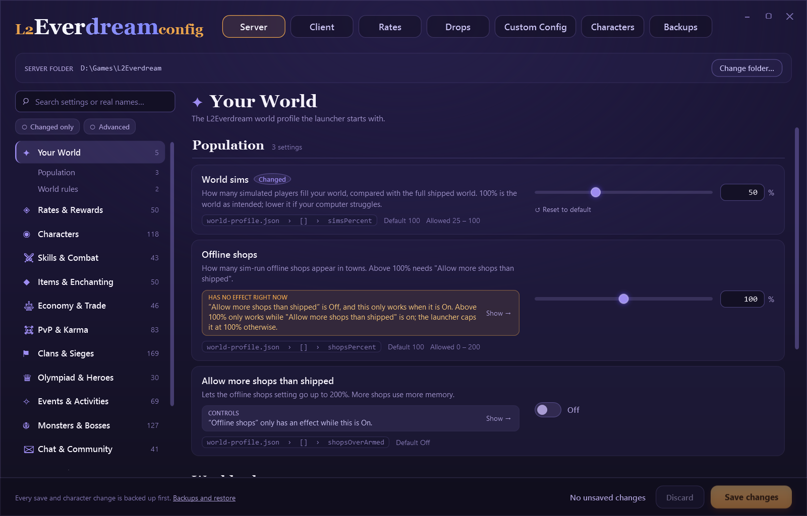
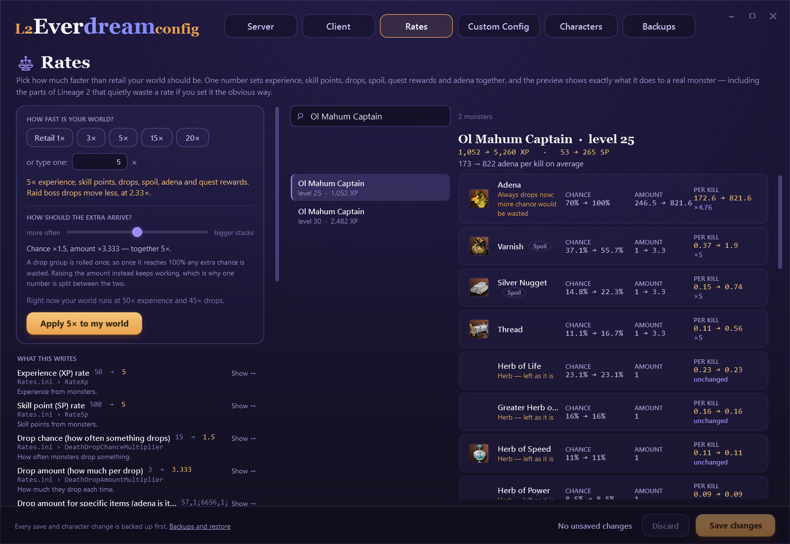
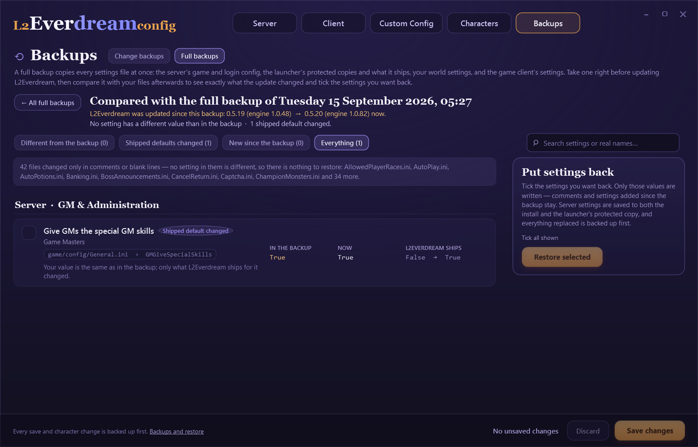

# L2Everdream Config

**Change every setting of your own L2Everdream world and your Lineage 2 client, without opening a single config file.**

[L2Everdream](https://l2everdream.com) lets you run a full Lineage 2 Interlude world on your own PC. That world is controlled by well
over a thousand settings spread across dozens of `.ini` files, some encrypted, some quietly rewritten by the launcher, and all named
things like `RateDropSpoil` or `AltPartyRange2`.

L2Everdream Config puts all of them in one window, with plain-English names, grouped by what they do, and limited to values the server
accepts. It also edits your characters' adena and inventories, and backs up everything before it changes anything.



> **For your local world only.** It edits the world and the client **on your own computer**. It cannot touch the public L2Everdream
> servers, and it never starts, stops or controls your world, its database or the game — that stays the launcher's job.
>
> **📖 [Full guides and a reference for all 1,408 settings are in the wiki](../../wiki).**

## Download and run

Get the latest version from the [Releases page](../../releases/latest):

| Download | Size | |
|---|---|---|
| **standalone** | 54 MB | Nothing else to install. **Pick this one.** |
| **needs-dotnet** | 1 MB | Smaller, but needs the [.NET 10 Desktop Runtime (x64)](https://dotnet.microsoft.com/download/dotnet/10.0) first. |

Unzip anywhere and run `L2EverdreamConfig.exe`. There is no installer. If Windows shows "Windows protected your PC", click **More
info** → **Run anyway** (it appears for any program without a paid code-signing certificate).

The first time, each tab asks for a folder: your L2Everdream install (the one with `game\config\Server.ini`, usually
`%LOCALAPPDATA%\L2Everdream`) and your Lineage 2 client. Nothing is guessed, and nothing is written until you click **Save changes**.

→ [Installation and first run](../../wiki/Installation-and-First-Run)

## What you can do

| | |
|---|---|
| **[Server settings](../../wiki/Server-Settings)** | 1,322 game and login settings plus the launcher's world settings, in 16 categories with search, filters and plain-English names. Every value is checked before it is saved. |
| **[Rates and drops](../../wiki/Rates-and-Drops)** | One number sets how fast your world is — experience, drops, spoil, adena and quest rewards together — split between drop chance and drop amount so none of it is wasted, with a before/after preview of any monster in the game. |
| **[Custom skill durations](../../wiki/Custom-Skill-Durations)** | Make buffs, songs and dances last longer (or shorter), one by one or hundreds at a time. |
| **[Client settings](../../wiki/Client-Settings)** | Graphics, sound, interface and connection settings, including the encrypted `l2.ini`. |
| **[How settings affect each other](../../wiki/How-Settings-Affect-Each-Other)** | Cards say what a setting depends on, when it has no effect right now, and what it controls. |
| **[Custom Config](../../wiki/Custom-Config)** | A read-only view of how L2Everdream differs from stock L2J Mobius. |
| **[Characters and inventories](../../wiki/Characters-and-Inventories)** | Adena and items of logged-out characters. New items are handed to the server to deliver, never written behind its back, and inventory limits are enforced as the server counts them. |
| **[Backups and restore](../../wiki/Backups-and-Restore)** | Every save, character change and restore is backed up first, and can be put back. |
| **[Full backups](../../wiki/Full-Backups-and-Launcher-Updates)** | Back up every settings file before an L2Everdream update, then compare afterwards and tick what you want restored. |





## Safety

- Nothing is written until you save (or confirm a character change or restore).
- Everything is backed up first, so any change can be put back.
- Values the server would reject are refused, with a plain reason.
- Client settings are never saved while the game is running, files are never restored while the world runs, and characters are only
  changed while they're logged out.
- The few values the launcher rewrites on every start are shown locked, with the reason.

→ [Privacy and safety](../../wiki/Privacy-and-Safety) · [Troubleshooting and FAQ](../../wiki/Troubleshooting-and-FAQ)

## Privacy

It never connects to the internet: no update checks, no analytics, no telemetry. Its only connections are to your own PC — checking
whether your world is running, and reading your world's database for the Characters tab.

## For developers

Requires Windows and the [.NET 10 SDK](https://dotnet.microsoft.com/download).

```
git clone https://github.com/PlexXoniC/L2EverDream.com-Config-Editor.git
cd L2EverDream.com-Config-Editor
dotnet build L2EverdreamConfig.slnx
dotnet test tests/L2Config.Core.Tests
dotnet run --project src/L2Config.App
```

| Project | What it is |
|---|---|
| `src/L2Config.Core` | No UI: catalog, INI editing and the client ini codec, saving, backups and restore, world database, skill and item catalogs |
| `src/L2Config.App` | The WPF app (MVVM, no UI libraries) |
| `tests/L2Config.Core.Tests` | 106 xUnit tests |
| `catalog/` | The friendly layer: curated names and relations, the Python generators, the generated catalog |
| `docs/wiki/` | The source of the [wiki](../../wiki), including the generated settings reference |

The only third-party runtime package is [MySqlConnector](https://mysqlconnector.net/) (MIT).
[`PROJECT.md`](PROJECT.md) is the full project guide, and
[`research/L2EVERDREAM-KNOWLEDGE.md`](research/L2EVERDREAM-KNOWLEDGE.md) documents how L2Everdream, its launcher and the client work.
More in [For developers](../../wiki/For-Developers).

## Licence

[MIT](LICENSE) — use it, change it, share it. Attribution is the only condition, and there is no warranty.

## Credits

Thanks to the **L2Everdream** project for making a local Lineage 2 world easy to run, and for knowing this tool was being built, and to
the **L2J Mobius** project, whose server this is built on and whose config comments are the source of most setting descriptions.

This is an independent tool. It is **not an official L2Everdream product** and is not endorsed by the L2Everdream or L2J Mobius
projects. Please don't send them support requests about it — open an issue [here](../../issues) instead.

Lineage II is a trademark of NCSOFT Corporation. This project is not affiliated with or endorsed by NCSOFT.
